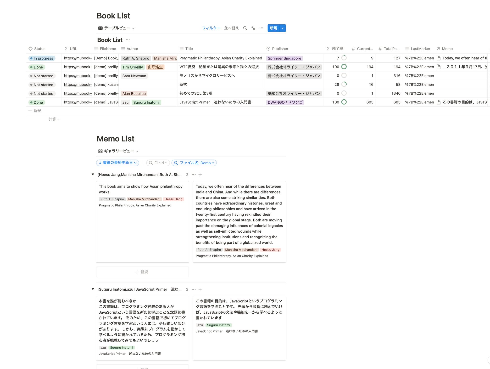

# mubook-hon

epub reader + Notion Sync + Memo.

## Usage

- WebSite: <https://mubook-hon.vercel.app/>
- Document: <https://efcl.notion.site/mubook-hon-addce6c324d44d749a73748f92e3a1a6>>

You need to set up Notion before using memo features.

## Features

- Read epub files on Dropbox
- Add memo to Notion with selected text
- Manage book list in Notion

## supported format

- [x] epub
  - bibi
- [ ] pdf
  - pdf.js

## LICENSE

MIT (c) azu

This project includes [Bibi](https://bibi.epub.link/).
[Bibi](https://bibi.epub.link/) is licensed under the [MIT License](https://github.com/satorumurmur/bibi/blob/master/LICENSE)

## Acknowledgements

- [Bibi](https://bibi.epub.link/)
