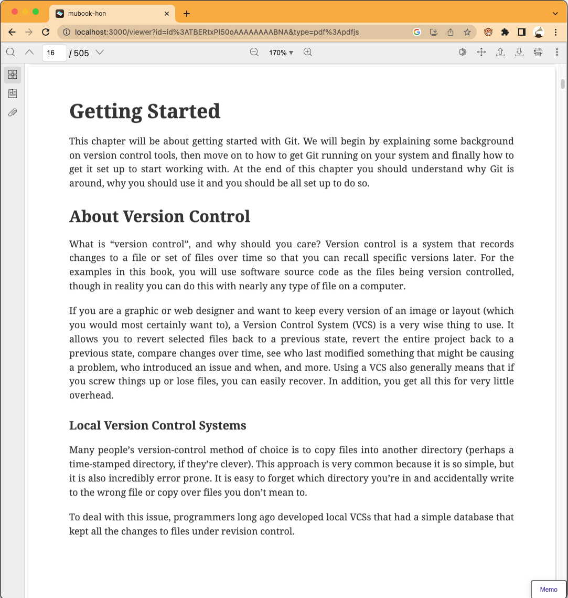

# mubook-hon

mubook-hon is epub/PDF reader + Notion Sync + Memo.

> epub viewer by [Bibi](https://bibi.epub.link/)

> PDF viewer by [PDF.js](https://mozilla.github.io/pdf.js/)

> Notion Database is created by mubook-hon

## Usage

- WebSite: <https://mubook-hon.vercel.app/>
- Document: <https://efcl.notion.site/mubook-hon-addce6c324d44d749a73748f92e3a1a6>

You need to set up Notion before using memo features.

## Features

- Read epub/PDF files on Dropbox
- Support cross browser on Mobile and PC
- Sync progress using Notion on cross devices
- Add memo to Notion with selected text
- Manage book list in Notion

## supported format

- [x] epub
  - [Bibi](https://bibi.epub.link/)
- [x] pdf
  - [PDF.js](https://mozilla.github.io/pdf.js/) + [react-pdf-viewer](https://react-pdf-viewer.dev/)(use developer license)

## Application mode

You can use <https://mubook-hon.vercel.app/> as PWA apps.

- [Add & open Chrome apps - Chrome Web Store Help](https://support.google.com/chrome_webstore/answer/3060053?hl=en)
- [Add to Home screen - Progressive web apps (PWAs) | MDN](https://developer.mozilla.org/en-US/docs/Web/Progressive_web_apps/Add_to_home_screen)

## Privacy Notices

- Request/Response to Dropbox: No Proxy
- Request/Response to Notion: CORS Proxy
  - Notion API does not support CORS
  - The default CORS Proxy is defined in [pages/api/notion-proxy](pages/api/notion-proxy)
  - You can override it by `localStorage.setItem("USER_DEFINED_NOTION_BASE_URL", "https://your-proxy.test/")`

## LICENSE

MIT (c) azu

This project includes [Bibi](https://bibi.epub.link/).
[Bibi](https://bibi.epub.link/) is licensed under the [MIT License](https://github.com/satorumurmur/bibi/blob/master/LICENSE)

## Acknowledgements

- [Bibi](https://bibi.epub.link/)
